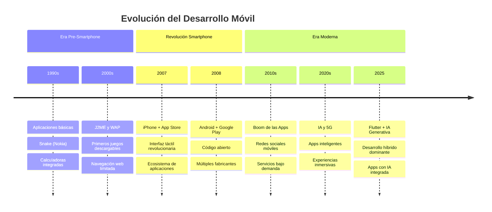
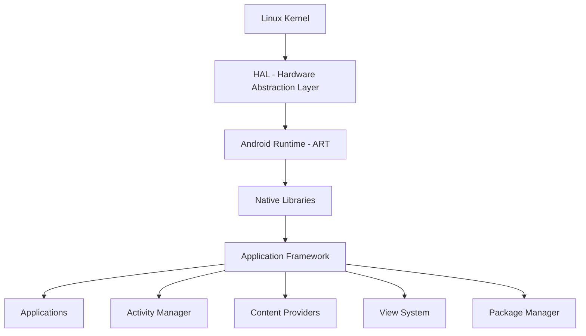
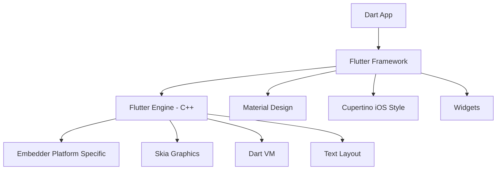

# Unidad 1: Historia y Panorama Actual del Desarrollo Móvil (2025)


## 📚 Índice

1. [Introducción](#introducción-y-objetivos)
2. [Historia del Desarrollo Móvil - Timeline Acelerado](#historia-del-desarrollo-móvil)
3. [La Era de los Smartphones: iOS vs Android](#la-era-de-los-smartphones)
4. [Panorama Actual 2025](#panorama-actual-2025)
5. [Android Nativo: Evolución y Estado Actual](#android-nativo-evolución-y-estado-actual)
6. [Flutter: La Apuesta de Google](#flutter-la-apuesta-de-google)
7. [Desarrollo de Videojuegos Móviles](#desarrollo-de-videojuegos-móviles)
8. [Actividades de Evaluación](#actividades-de-evaluación)
9. [Recursos para el Curso](#recursos-para-el-curso)

---

## 🎯 Introducción

### ¿Por qué Estas Tecnologías?

#### 🤖 Android Nativo 
- **Fundamentos sólidos**: Base para entender cómo funciona Android
- **Control total**: Acceso completo a APIs del sistema
- **Mercado laboral**: Muchas empresas aún usan Views tradicionales
- **Learning path**: Comprender antes de modernizar

#### 🎯 Flutter
- **Multiplataforma**: Un código, múltiples plataformas
- **Performance**: Rendimiento nativo en ambas plataformas
- **Tendencia creciente**: Adopción masiva en la industria
- **Productividad**: Desarrollo más rápido y eficiente

---

## 📱 Historia del Desarrollo Móvil

### 🚀 Timeline Crítico - Lo Esencial



### 🔑 Hitos Clave para Desarrolladores

| Año | Evento | Impacto en el Desarrollo |
|-----|--------|-------------------------|
| **2008** | Lanzamiento Android SDK | Desarrollo nativo gratuito |
| **2008** | App Store abierto | Modelo de monetización |
| **2011** | Android 4.0 (API 14+) | Fragmentos y UI moderna |
| **2017** | Flutter Alpha | Desarrollo multiplataforma |
| **2019** | Flutter 1.0 | Producción ready |
| **2021** | Jetpack Compose Stable | UI declarativa Android |
| **2025** | Flutter 4.0 | Integración IA nativa |

---

## 📱 La Era de los Smartphones

### 🍎 iOS: El Pionero
**Filosofía**: Ecosystem cerrado, experiencia controlada

```swift
// Ejemplo conceptual iOS - Filosofía de desarrollo
class iOSPhilosophy {
    let humanInterfaceGuidelines = true
    let appStoreReview = "Strict"
    let designPrinciples = ["Clarity", "Deference", "Depth"]
    
    func developApp() {
        // Seguir las reglas estrictas de Apple
        // Diseño consistente y pulido
        // Review process obligatorio
    }
}
```

### 🤖 Android: La Revolución Abierta
**Filosofía**: Open source, flexibilidad total

```java
// Android tradicional - Views y Activities
public class MainActivity extends AppCompatActivity {
    @Override
    protected void onCreate(Bundle savedInstanceState) {
        super.onCreate(savedInstanceState);
        setContentView(R.layout.activity_main);
        
        // Libertad total de personalización
        // Múltiples fabricantes
        // Acceso a APIs del sistema
    }
}
```

### 📊 Cuota de Mercado 2025

```
🌍 Distribución Global:
├── Android: 70.8% (3.8 mil millones de dispositivos)
├── iOS: 28.4% (1.5 mil millones de dispositivos)  
└── Otros: 0.8% (HarmonyOS, KaiOS)

💰 Ingresos por App:
├── iOS: $85 mil millones (mayor ARPU)
└── Android: $47 mil millones (mayor volumen)
```

---

## 🚀 Panorama Actual 2025

### 📈 El Estado del Desarrollo Móvil

#### Estadísticas Clave
- **6.8 mil millones** de usuarios de smartphones
- **28.7 millones** de desarrolladores activos
- **4.8 horas** de uso diario promedio
- **$935 mil millones** en ingresos del sector

#### 🔧 Tecnologías Dominantes por Categoría

| Categoría | Líderes 2025 | Tendencia |
|-----------|--------------|-----------|
| **Nativo iOS** | Swift + SwiftUI | ↗️ Crecimiento estable |
| **Nativo Android** | Kotlin + Jetpack Compose | ↗️ Modernización |
| **Multiplataforma** | Flutter, React Native | 🚀 Explosión |
| **Híbrido** | Ionic, Capacitor | ↘️ Declive gradual |
| **PWA** | Angular, React + PWA APIs | ↗️ Resurgimiento |

### 🎯 ¿Por Qué Flutter Está Ganando?

#### Ventajas Competitivas:
1. **Un solo codebase** → iOS + Android + Web + Desktop
2. **Performance nativo** → Compilación directa, no interpretado
3. **Hot Reload** → Desarrollo 3x más rápido
4. **Google backing** → Respaldo corporativo sólido
5. **Growing ecosystem** → Paquetes y comunidad en explosión

#### Adopción Enterprise:
- **BMW**: Apps de conectividad vehicular
- **Alibaba**: Xianyu app (50M+ usuarios)
- **Google**: Google Ads, Google Pay
- **Toyota**: Apps de concesionarios

---

## 🤖 Android Nativo: Evolución y Estado Actual

### 🏗️ Arquitectura Android - Lo que Necesitas Saber



### 📚 Evolución del Development Stack

#### Era Clásica (2008-2019)
```java
// Activities + Fragments + XML Layouts
public class MainActivity extends AppCompatActivity {
    private TextView textView;
    private Button button;
    
    @Override
    protected void onCreate(Bundle savedInstanceState) {
        super.onCreate(savedInstanceState);
        setContentView(R.layout.activity_main);
        
        textView = findViewById(R.id.textView);
        button = findViewById(R.id.button);
        
        button.setOnClickListener(v -> {
            textView.setText("¡Hola desde Android!");
        });
    }
}
```

#### Era Moderna (2019-Presente)
```kotlin
// Kotlin + ViewBinding + MVVM
class MainActivity : AppCompatActivity() {
    private lateinit var binding: ActivityMainBinding
    private lateinit var viewModel: MainViewModel
    
    override fun onCreate(savedInstanceState: Bundle?) {
        super.onCreate(savedInstanceState)
        binding = ActivityMainBinding.inflate(layoutInflater)
        setContentView(binding.root)
        
        viewModel = ViewModelProvider(this)[MainViewModel::class.java]
        
        binding.button.setOnClickListener {
            viewModel.updateMessage()
        }
        
        viewModel.message.observe(this) { message ->
            binding.textView.text = message
        }
    }
}
```

### ⚡ ¿Por Qué Empezar con Views Tradicionales?

#### Ventajas Pedagógicas:
1. **Fundamentos claros**: Entender el ciclo de vida de Android
2. **Debugging más fácil**: Stack traces más comprensibles
3. **Material abundante**: Tutoriales y documentación extensa
4. **Mercado laboral**: Muchas apps legacy aún las usan

#### Herramientas de Desarrollo:
- **Android Studio**: IDE oficial de Google
- **ADB**: Android Debug Bridge
- **Emulators**: Simulación de dispositivos
- **Layout Inspector**: Debug de interfaces visuales

### 📱 Ejemplo Práctico - App "Hola Mundo"

#### Layout XML (`activity_main.xml`):
```xml
<?xml version="1.0" encoding="utf-8"?>
<LinearLayout xmlns:android="http://schemas.android.com/apk/res/android"
    android:layout_width="match_parent"
    android:layout_height="match_parent"
    android:orientation="vertical"
    android:padding="16dp"
    android:gravity="center">

    <TextView
        android:id="@+id/tv_message"
        android:layout_width="wrap_content"
        android:layout_height="wrap_content"
        android:text="¡Bienvenidos a Android!"
        android:textSize="24sp"
        android:textColor="@android:color/black"
        android:layout_marginBottom="32dp" />

    <Button
        android:id="@+id/btn_change"
        android:layout_width="wrap_content"
        android:layout_height="wrap_content"
        android:text="Cambiar Mensaje"
        android:backgroundTint="@android:color/holo_blue_dark"
        android:textColor="@android:color/white" />

</LinearLayout>
```

#### Activity Kotlin:
```kotlin
class MainActivity : AppCompatActivity() {
    private var isOriginalMessage = true
    
    override fun onCreate(savedInstanceState: Bundle?) {
        super.onCreate(savedInstanceState)
        setContentView(R.layout.activity_main)
        
        val textView = findViewById<TextView>(R.id.tv_message)
        val button = findViewById<Button>(R.id.btn_change)
        
        button.setOnClickListener {
            val newMessage = if (isOriginalMessage) {
                "¡Hola desde Kotlin!"
            } else {
                "¡Bienvenidos a Android!"
            }
            
            textView.text = newMessage
            isOriginalMessage = !isOriginalMessage
        }
    }
}
```

---

## 🎯 Flutter: La Apuesta de Google

### 🚀 ¿Qué es Flutter?

Flutter es el **framework multiplataforma** de Google que permite crear aplicaciones nativas para móvil, web y desktop desde un **único codebase**.

#### Filosofía de Flutter:
- **"Write once, run everywhere"** pero con performance nativo
- **Widget-based architecture**: Todo es un widget
- **Declarative UI**: Describes lo que quieres, no cómo conseguirlo
- **Hot reload**: Cambios instantáneos durante desarrollo

### 🏗️ Arquitectura Flutter



### 💎 Ventajas de Flutter vs Android Nativo

| Aspecto | Android Nativo | Flutter |
|---------|---------------|---------|
| **Desarrollo** | Específico Android | iOS + Android |
| **Lenguaje** | Kotlin/Java | Dart |
| **UI Framework** | Views/Compose | Widgets |
| **Performance** | Óptimo | Casi nativo (95%+) |
| **Tiempo desarrollo** | 100% | 50-60% |
| **Mantenimiento** | 2 codebases | 1 codebase |
| **Acceso APIs nativas** | Total | Plugins/Platform channels |

### 🎨 Flutter vs Android - Ejemplo Comparativo

#### Android Nativo (Kotlin):
```kotlin
// MainActivity.kt
class MainActivity : AppCompatActivity() {
    private var counter = 0
    
    override fun onCreate(savedInstanceState: Bundle?) {
        super.onCreate(savedInstanceState)
        setContentView(R.layout.activity_main)
        
        val counterText = findViewById<TextView>(R.id.counter_text)
        val incrementButton = findViewById<Button>(R.id.increment_button)
        
        updateCounterText(counterText)
        
        incrementButton.setOnClickListener {
            counter++
            updateCounterText(counterText)
        }
    }
    
    private fun updateCounterText(textView: TextView) {
        textView.text = "Contador: $counter"
    }
}
```

```xml
<!-- activity_main.xml -->
<LinearLayout xmlns:android="http://schemas.android.com/apk/res/android"
    android:layout_width="match_parent"
    android:layout_height="match_parent"
    android:orientation="vertical"
    android:gravity="center">

    <TextView
        android:id="@+id/counter_text"
        android:layout_width="wrap_content"
        android:layout_height="wrap_content"
        android:textSize="24sp" />

    <Button
        android:id="@+id/increment_button"
        android:layout_width="wrap_content"
        android:layout_height="wrap_content"
        android:text="Incrementar" />

</LinearLayout>
```

#### Flutter (Dart):
```dart
import 'package:flutter/material.dart';

void main() {
  runApp(MyApp());
}

class MyApp extends StatelessWidget {
  @override
  Widget build(BuildContext context) {
    return MaterialApp(
      title: 'Flutter Demo',
      theme: ThemeData(
        primarySwatch: Colors.blue,
      ),
      home: CounterPage(),
    );
  }
}

class CounterPage extends StatefulWidget {
  @override
  _CounterPageState createState() => _CounterPageState();
}

class _CounterPageState extends State<CounterPage> {
  int _counter = 0;

  void _incrementCounter() {
    setState(() {
      _counter++;
    });
  }

  @override
  Widget build(BuildContext context) {
    return Scaffold(
      appBar: AppBar(
        title: Text('Flutter Counter'),
      ),
      body: Center(
        child: Column(
          mainAxisAlignment: MainAxisAlignment.center,
          children: <Widget>[
            Text(
              'Contador: $_counter',
              style: TextStyle(fontSize: 24),
            ),
            SizedBox(height: 20),
            ElevatedButton(
              onPressed: _incrementCounter,
              child: Text('Incrementar'),
            ),
          ],
        ),
      ),
    );
  }
}
```

### 📈 Crecimiento de Flutter (2025)

#### Estadísticas de Adopción:
- **600,000+** apps publicadas usando Flutter
- **46%** de desarrolladores multiplataforma lo usan
- **Google, BMW, Alibaba** entre usuarios enterprise
- **#1** framework multiplataforma en Stack Overflow Survey 2024

#### ¿Por Qué Está Triunfando Flutter?

1. **Developer Experience**: Hot reload = productividad extrema
2. **Performance**: Compilación nativa vs interpretación híbrida
3. **Design Systems**: Material Design y Cupertino integrados
4. **Community**: Ecosistema de packages en explosión
5. **Google Support**: Inversión masiva en el framework

---

## 🎮 Desarrollo de Videojuegos Móviles

El mercado de videojuegos móviles representa **$103 mil millones** en 2025, siendo el segmento más grande de la industria gaming.

### 📊 Panorama del Gaming Móvil 2025

#### Números Clave:
- **3.2 mil millones** de gamers móviles activos
- **54%** de todos los ingresos gaming globales
- **Candy Crush** sigue siendo el rey (>$20M mensuales)
- **Genshin Impact** lidera los RPG móviles ($300M+ mensuales)

#### Géneros Dominantes:
1. **Puzzle/Casual**: Candy Crush, Among Us
2. **Battle Royale**: PUBG Mobile, Free Fire
3. **RPG/Gacha**: Genshin Impact, Honkai Star Rail
4. **Strategy**: Clash of Clans, Rise of Kingdoms
5. **Hypercasual**: Subway Surfers, Temple Run

### 🛠️ Tecnologías de Desarrollo

#### 🎯 Unity - El Rey del Gaming Móvil

Más del 70% de los juegos para dispositivos móviles se crean en Unity, convirtiéndolo en el motor dominante del sector.

**Ventajas de Unity:**
- **Multiplataforma**: iOS, Android, PC, Console, Web
- **Asset Store**: Marketplace masivo de assets y scripts
- **Visual Scripting**: Desarrollo sin código para diseñadores
- **2D y 3D**: Versatilidad completa
- **Community**: Comunidad gigante y tutoriales infinitos

```csharp
// Ejemplo Unity - Script básico de movimiento
using UnityEngine;

public class PlayerMovement : MonoBehaviour
{
    public float speed = 5.0f;
    private Rigidbody2D rb;
    
    void Start()
    {
        rb = GetComponent<Rigidbody2D>();
    }
    
    void Update()
    {
        // Input táctil para móviles
        if (Input.touchCount > 0)
        {
            Touch touch = Input.GetTouch(0);
            Vector2 touchPosition = Camera.main.ScreenToWorldPoint(touch.position);
            
            Vector2 direction = (touchPosition - rb.position).normalized;
            rb.velocity = direction * speed;
        }
    }
}
```

#### 🎮 Unreal Engine - Gráficos de Nueva Generación

Unreal Engine incluye todo lo necesario para crear juegos para móvil y multiplataforma muy realistas, aunque tradicionalmente se ha enfocado más en PC y consolas.

**Ventajas de Unreal:**
- **Gráficos Premium**: Fotorealismo sin rival
- **Blueprint System**: Programación visual avanzada
- **Nanite Virtualized Geometry**: Tecnología de vanguardia
- **Free**: Gratis hasta $1M de ingresos

**Desventajas para Móvil:**
- **Tamaño**: Apps más pesadas (>100MB)
- **Rendimiento**: el proceso suele implicar la simplificación de shaders, métodos de renderizado, etc. (que por defecto están orientados a formatos AAA)
- **Curva de aprendizaje**: Más complejo que Unity

#### 🚀 Engines Alternativos

**Godot** (Open Source):
- Completamente gratuito
- Scripting con GDScript o C#
- Lightweight para móviles
- Crecimiento exponencial en 2025

**Defold** (King/Activision):
- Especializado en 2D
- Lua scripting
- Apps ultra-ligeras (<10MB)
- Usado por King (Candy Crush)

### 🎮 Géneros y Tecnologías Específicas

#### Casual/Hypercasual Games
- **Unity 2D** + **C#**
- Desarrollo rápido (2-4 semanas)
- Monetización por ads
- Mecánicas simples, adictivas

#### Mid-Core Games (RPG, Strategy)
- **Unity 3D** o **Unreal**
- Desarrollo largo (6-18 meses)
- Monetización F2P + IAP
- Mecánicas complejas, meta-game

#### Premium/Console-Quality
- **Unreal Engine** principalmente
- Desarrollo AAA (12-36 meses)
- Monetización premium ($10-60)
- Gráficos fotorealistas

### 📱 Consideraciones Técnicas Móviles

#### Optimización de Performance:
```csharp
// Unity - Optimización para móviles
public class MobileOptimization : MonoBehaviour
{
    void Start()
    {
        // Reducir calidad gráfica para móviles
        if (Application.platform == RuntimePlatform.Android || 
            Application.platform == RuntimePlatform.IPhonePlayer)
        {
            QualitySettings.SetQualityLevel(1); // Nivel bajo/medio
            Application.targetFrameRate = 30;   // 30 FPS en móviles
            Screen.sleepTimeout = SleepTimeout.NeverSleep;
        }
    }
    
    void Update()
    {
        // Pooling de objetos en lugar de Instantiate/Destroy
        // Usar LOD (Level of Detail) para modelos
        // Comprimir texturas automáticamente
    }
}
```

#### Controles Táctiles:
- **Touch Input**: Gestos naturales
- **Virtual Joysticks**: Para juegos complejos
- **Gyroscope**: Controles por inclinación
- **Haptic Feedback**: Vibración contextual

### 🎯 Oportunidades de Mercado 2025

#### Nichos Emergentes:
1. **AR Games**: Pokémon GO successors
2. **Cloud Gaming**: Stadia, xCloud integration  
3. **Blockchain Games**: NFT integration, P2E
4. **Educational Games**: Duolingo-style gamification
5. **Health & Fitness**: Ring Fit Adventure móvil

#### Consideraciones de Monetización:
- **F2P + IAP**: 95% del mercado móvil
- **Battle Pass**: Modelo Fortnite adaptado
- **Ads Rewarded**: Publicidad voluntaria
- **Subscription**: Modelos premium recurrentes

---

## 🔮 Lo que Viene Después

### 📅 Roadmap 

#### **Unidad 2**: Fundamentos Android Nativo (6 horas)
- Activities y Fragments lifecycle
- Layouts y Views tradicionales
- Intents y navegación
- Almacenamiento local (SharedPreferences, SQLite)

#### **Unidad 3**: Android Avanzado (8 horas)
- RecyclerView y adaptadores
- Networking y APIs REST
- Cámaras y multimedia
- Sensores y geolocalización

#### **Unidad 4**: Introducción a Flutter (6 horas)
- Dart language basics
- Widgets fundamentales
- Stateful vs Stateless widgets
-